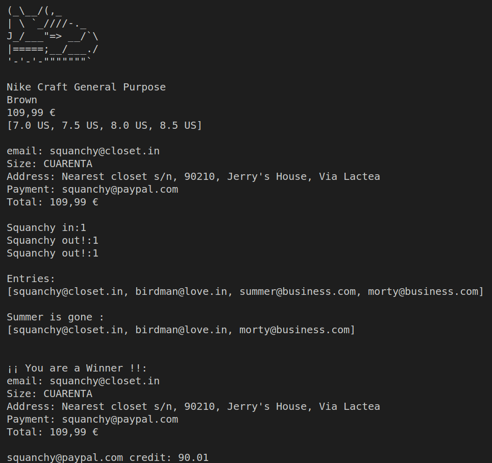

# Sneaker Raffle solucionado

En este repositorio se encuentra la solución del examen Sneaker Raffle realizado por nuestro tutor de DAW Dual, [David Gelpi](https://github.com/dfleta).
## Herramientas

El proyecto se tenía que desarrollar a partir de las herramientas que nos ofreció dfleta en el [repositorio del examen](https://github.com/dfleta/sneaker-raffle) , que fueron:

- Diagrama UML
- Clase main
- Método para dibujar el sneaker
- Historias de usuario
- Salida por consola

## Propósito

El propósito de este kata es crear un pequeño programa para hacer rifas de zapatillas (La rifa es para elegir quién la compra, no es regalada). La zapatilla debe sortearse entre los participantes, que se deben inscribir.

Cada participante tiene que añadir un método de pago. Si le toca, se intentará cobrar el precio de la zapatilla.

Solo se permite una participación por persona, así que hay que verificar que nadie pueda participar varias veces.

Además de reforzar los conceptos aprendidos en clase de:

- TDD
- Streams
- Bucles
- Solid (SRP, OCP, LSP, DIP)
- Interfaces
- Interpretación de documentos XML
- Tipos enumerados
- Principios básicos de POO (Abstracción, encapsulación,  polimorfismo)
- Control de versiones con git (Creación de ramas, conventional commits)

## Mejoras

En este repositorio intento hacer las cosas mejor que durante el examen, parándome a pensar un poco más e intentando hacer un desarrollo más limpio.

- Lo primero que quiero remarcar es el uso de streams, en el examen no utilicé muchos, hice muchas cosas con bucles. 
- Un mejor desarrollo del TDD, ya que en el examen hubieron cosas que no testeé. 
- Una mejor elección de la estructura de datos necesaria para guardar los participantes en la rifa. En este uso un HashSet.
- Correción de fichero pom.xml, en el examen no subí la adición que hice, añadí el plugin para la creación del fichero jar.
- Mejorar la salida por pantalla, en el examen me dejé unas tabulaciones sin poner y empeoraban bastante la salida por pantalla.
- Lo próximo que haré en otra rama, será automatizar el registro de las cuentas de PayPal de los usuarios, que es algo diferente a lo que se pide en la última historia de usuario.
- Acabar la última hisotria de usuario.

Disfruté bastante rehaciendo este examen, el dominio y la forma de redactarlo me pareció bastante entretenida. 

## Diagrama UML

Este es el diagrama UML que nos proporcionó nuestro profesor David Fleta.

## Historias de usuario

Estas son las siguientes historias de usuario por las que nos debíamos guiar.

## Salida por consola

Esta es la salida por consola esperada.

Para más información, recoiendo visitar el [repositorio del examen original](https://github.com/dfleta/sneaker-raffle), donde todo está perfectamente explicado en el README.

El diagrama, las historias de usuario y la salida por consola han sido proporcionados por [dfleta](https://github.com/dfleta).
